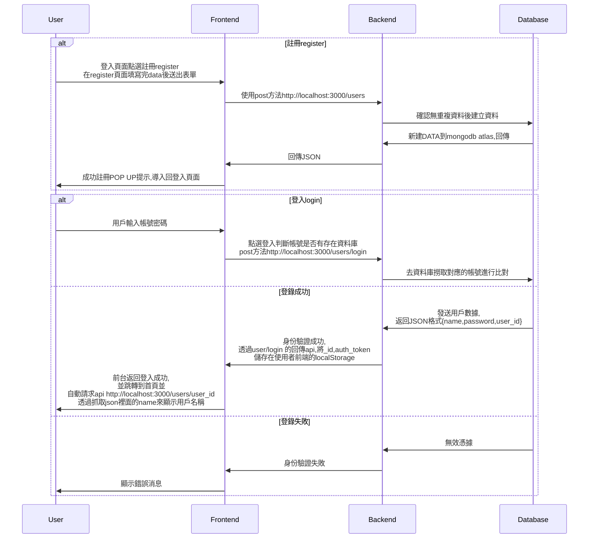

npm start代表在正式環境 
npm run dev代表在測試環境 
ctrl+c 離開環境

登入測試 
帳號：jack_body_parser_5 
密碼：123

帳號：jacktestaccount
密碼：jack1234

帳號：我測試
密碼：jack1234

開啟mermaid: ctrl + shift + v

```mermaid
sequenceDiagram

    participant U as User
    participant F as Frontend
    participant B as Backend
    participant DB as Database
    alt  註冊register
        U->>F: 登入頁面點選註冊register<BR>在register頁面填寫完data後送出表單
        F->>B:使用post方法http://localhost:3000/users
        B->>DB: 確認無重複資料後建立資料 
        DB->>B:新建DATA到mongodb atlas,回傳
        B->>F: 回傳JSON
        F->>U: 成功註冊POP UP提示,導入回登入頁面
end
alt 登入login
    U->>F: 用戶輸入帳號密碼
    F->>B: 點選登入判斷帳號是否有存在資料庫<br>post方法http://localhost:3000/users/login
    B->>DB: 去資料庫撈取對應的帳號進行比對
    else 登錄成功
        DB->>B: 發送用戶數據,<br>返回JSON格式{name,password,user_id}
        B->>F: 身份驗證成功,<br>透過user/login 的回傳api,將_id,auth_token<br>儲存在使用者前端的localStorage
        F->>U: 前台返回登入成功,<br>並跳轉到首頁並<br>自動請求api http://localhost:3000/users/user_id<br>透過抓取json裡面的name來顯示用戶名稱
    else 登錄失敗
        DB->>B: 無效憑據
        B->>F: 身份驗證失敗
        F->>U: 顯示錯誤消息    
end
```